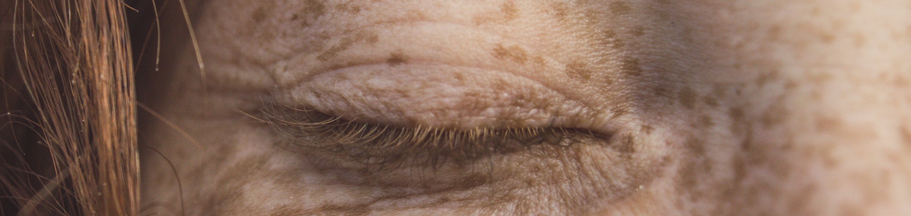

# Automatic Skin Cancer Detection based on Convolutional Neural Networks

## Project Overview:
Given the rising incidence of skin cancer, particularly melanoma, and the crucial role of early detection in improving survival rates, a CNNs-based model is developed to support early-stage detection.

The dermoscopic images used to train the model encompass seven lesion types and underwent pre-processing involving resizing, normalization, and subsequent division into training, fine-tuning, and evaluation sets.

The model architecture comprises 3 convolutional layers, 3 max-pooling layers, a flattening layer, a fully connected layer, and an output layer. Parameter tuning strategies are presented too, and different combination of epochs, batch sizes, and learning rates are evaluated showcasing the importance of parameter tuning for improved performance.

Leveraging artificial intelligence (AI) and CNNs in dermatology presents a promising approach for early diagnosis and automated detection systems. The analysis demonstrates the potential of CNNs in skin cancer detection, emphasizing the non-invasive and cost-effective nature of such AI-based diagnostic tools.